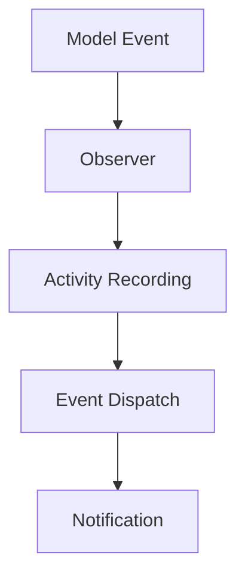
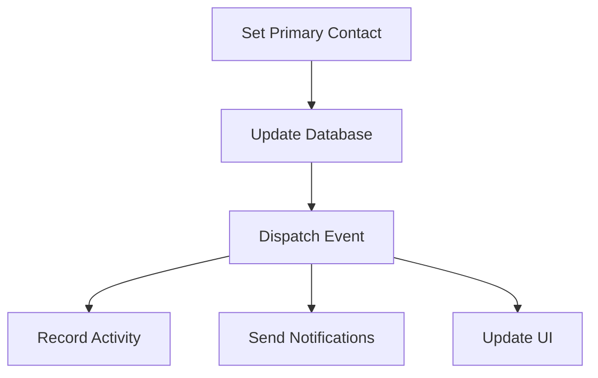

# System Design Documentation

## Overview

The PTT Laravel CRM system is built using a modern, event-driven architecture that combines the power of Laravel with the TALL stack (Tailwind CSS, Alpine.js, Laravel, and Livewire). This document outlines the core architectural decisions and system components.

## Core Contexts

### 1. Company Context

The Company context represents business entities in the system and serves as a central hub for related data.

#### Key Components:
- **Company Model**: Core entity with relationships to contacts and activities
- **Company Observer**: Handles lifecycle events and activity tracking
- **Company Status Management**: Tracks and manages company status changes

#### Relationships:
- Has many Contacts
- Has many Activities
- Has one Account Manager (User)
- Has many Opportunities (planned)

### 2. Contact Context

The Contact context manages individual contacts associated with companies.

#### Key Components:
- **Contact Model**: Represents individual contacts with primary contact designation
- **Contact Observer**: Manages contact lifecycle and activity tracking
- **Primary Contact Management**: Handles primary contact designation logic

#### Relationships:
- Belongs to Company
- Has many Activities
- Has many Tasks (planned)

### 3. Activity Context

The Activity context provides a comprehensive audit trail of all system events.

#### Key Components:
- **Activity Model**: Central tracking system for all events
- **HasActivities Trait**: Provides activity recording capabilities to models
- **Activity Types**: Predefined activity types for consistent tracking

#### Activity Types:
```php
const TYPE_CREATED = 'created';
const TYPE_UPDATED = 'updated';
const TYPE_DELETED = 'deleted';
const TYPE_NOTE_ADDED = 'note_added';
const TYPE_EMAIL_SENT = 'email_sent';
const TYPE_TASK_CREATED = 'task_created';
const TYPE_TASK_COMPLETED = 'task_completed';
const TYPE_STATUS_CHANGED = 'status_changed';
const TYPE_STAGE_CHANGED = 'stage_changed';
const TYPE_CUSTOM = 'custom';
```

## Event-Driven Architecture

### 1. Event System

The system uses Laravel's event system for decoupled communication between components.

#### Event Components:
- **Events**: Data containers for system events
- **Listeners**: Handle event processing and side effects
- **Event Service Provider**: Registers events and listeners

#### Example Event Flow:
1. Contact is set as primary
2. `ContactSetAsPrimary` event is dispatched
3. `HandleContactSetAsPrimary` listener processes the event
4. Activities are recorded
5. Notifications are sent

### 2. Notification System

Built on Laravel's notification system with multiple channels.

#### Notification Channels:
- **Database**: For in-app notifications
- **Mail**: For email notifications
- **UI**: Real-time updates through Livewire

#### Example Notification:
```php
class ContactSetAsPrimaryNotification extends Notification
{
    public function via($notifiable): array
    {
        return ['mail', 'database'];
    }
}
```

## Data Flow

### 1. Activity Recording



### 2. Primary Contact Change



## Security Considerations

### 1. Authentication & Authorization
- Laravel's built-in authentication system
- Role-based access control
- API token authentication for external access

### 2. Data Protection
- Input validation and sanitization
- CSRF protection
- XSS prevention
- SQL injection prevention through Eloquent

## Performance Optimization

### 1. Database Optimization
- Proper indexing
- Eager loading of relationships
- Query optimization

### 2. Caching Strategy
- Redis for session and cache
- Model caching where appropriate
- Query result caching

### 3. Queue System
- Async processing of notifications
- Background job processing
- Event handling

## Future Considerations

### 1. Planned Features
- Task Management System
- Opportunity Tracking
- Email Integration
- Calendar Integration
- Reporting System

### 2. Scalability
- Horizontal scaling capability
- Microservices architecture consideration
- API-first approach for external integrations

## Development Guidelines

### 1. Code Organization
- Follow PSR-12 standards
- Use Laravel best practices
- Implement SOLID principles

### 2. Testing Strategy
- Unit tests for models and services
- Feature tests for controllers and Livewire components
- Browser tests for critical user flows

### 3. Documentation
- Keep documentation up to date
- Document all new features
- Include code examples
- Maintain API documentation 